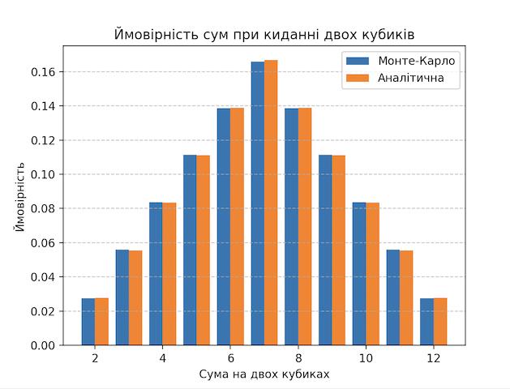

# Висновки

## Завдання 1

## Завдання 2

## Завдання 3

## Завдання 4

## Завдання 5

## Завдання 6

## Завдання 7: Використання методу Монте-Карло (кубики)

## Опис та реалізація

У цьому завданні я застосувала метод Монте-Карло для моделювання ймовірностей сум при киданні двох гральних кубиків.  
Було зімітовано велику кількість кидків, підраховано суми чисел на кубиках та визначено ймовірності кожної можливої суми (від 2 до 12).  
Ймовірності обчислювались як відношення кількості появ певної суми до загальної кількості експериментів (`counts / N`).  
Отримані результати порівняно з аналітичними значеннями, а також побудовано графік для наочного відображення.  

---

## Результати експериментів

|     | Сума | Ймовірність (Монте-Карло) | Ймовірність (аналітична) |
|-----|------|---------------------------|-------------------------|
| 0   | 2    | 0.027466                  | 0.027778                |
| 1   | 3    | 0.055883                  | 0.055556                |
| 2   | 4    | 0.083550                  | 0.083333                |
| 3   | 5    | 0.111254                  | 0.111111                |
| 4   | 6    | 0.138701                  | 0.138889                |
| 5   | 7    | 0.165928                  | 0.166667                |
| 6   | 8    | 0.138689                  | 0.138889                |
| 7   | 9    | 0.111285                  | 0.111111                |
| 8   | 10   | 0.083698                  | 0.083333                |
| 9   | 11   | 0.055895                  | 0.055556                |
| 10  | 12   | 0.027651                  | 0.027778                |

## Візуалізація результатів

Нижче наведено графік, який показує порівняння ймовірностей сум при киданні двох кубиків:

## Висновки

- Метод Монте-Карло дозволяє отримати ймовірності сум при киданні кубиків із дуже високою точністю.  
- При великій кількості симуляцій (наприклад, 1 000 000 кидків) результати практично збігаються з аналітичними розрахунками.  
- Відхилення від теоретичних значень мінімальні (похибка становить лише тисячні долі).  
- Це підтверджує правильність теоретичних імовірностей і демонструє ефективність методу Монте-Карло для моделювання дискретних випадкових процесів.
