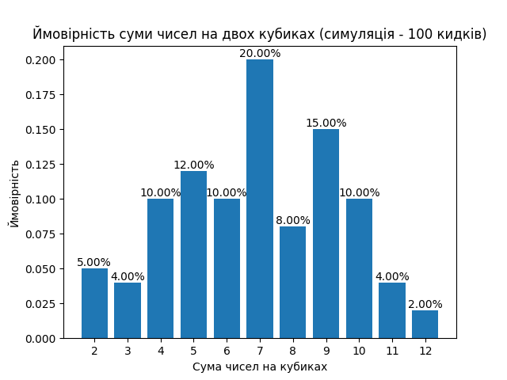
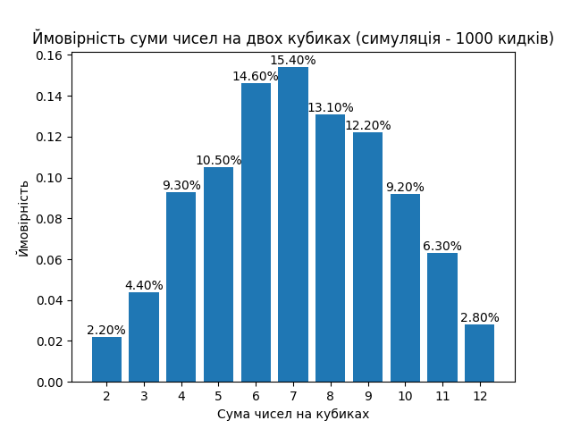
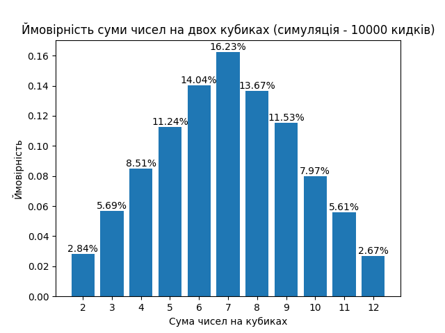
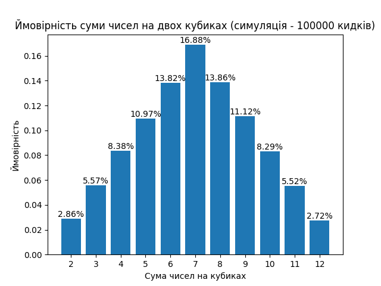
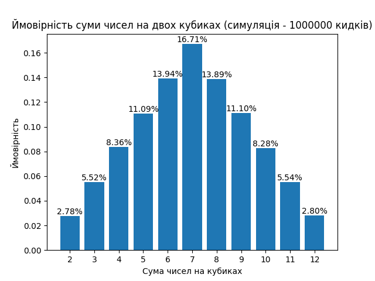
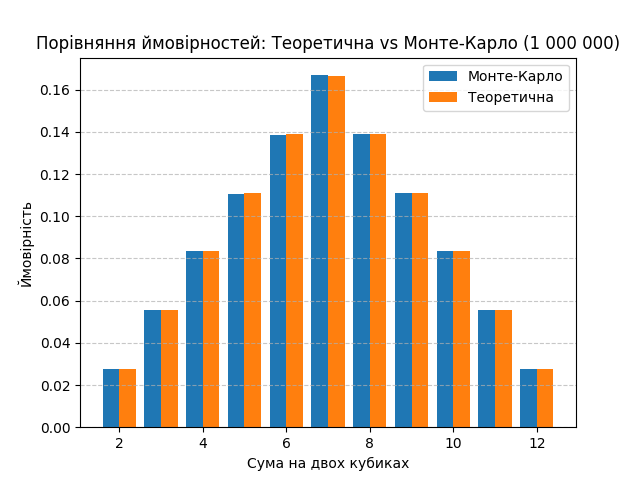

# Висновки

## Завдання 7: Використання методу Монте-Карло (кубики)

## Опис та реалізація

У цьому завданні ми моделюємо кидки двох гральних кубиків для оцінки ймовірностей випадіння сум від 2 до 12. Реалізовано функцію симуляції методом Монте-Карло та побудовано графічне порівняння отриманих ймовірностей з аналітичними (теоретичними). Код організовано так, щоб демонструвати, як результати змінюються залежно від кількості симуляцій.

Ймовірності обчислювались як відношення кількості появ певної суми до загальної кількості експериментів (`counts / N`).  

---

## Результати експериментів (Симуляція vs Теоретичні значення)

Нижче наведено порівняння імовірностей сум при киданні двох кубиків, отриманих у результаті симуляцій
(100, 1 000, 10 000, 100 000, 1 000 000 кидків), із теоретичними значеннями.

- Значення у стовпці “Теоретична” — це точні ймовірності для суми при киданні двох гральних кубиків.
- Значення у кожному стовпці симуляцій — це результат обчислень через метод Монте-Карло.

 

| Сума | Теоретична | 100 кидків | 1 000 кидків | 10 000 кидків | 100 000 кидків | 1 000 000 кидків |
|------|------------|------------|--------------|---------------|----------------|------------------|
| 2    | 0.0278     | 0.0500     | 0.0220       | 0.0284        | 0.0286         | 0.0278           |
| 3    | 0.0556     | 0.0400     | 0.0440       | 0.0569        | 0.0557         | 0.0552           |
| 4    | 0.0833     | 0.1000     | 0.0930       | 0.0851        | 0.0838         | 0.0836           |
| 5    | 0.1111     | 0.1200     | 0.1050       | 0.1124        | 0.1097         | 0.1109           |
| 6    | 0.1389     | 0.1000     | 0.1460       | 0.1404        | 0.1382         | 0.1394           |
| 7    | 0.1667     | 0.2000     | 0.1540       | 0.1623        | 0.1688         | 0.1671           |
| 8    | 0.1389     | 0.0800     | 0.1310       | 0.1367        | 0.1386         | 0.1389           |
| 9    | 0.1111     | 0.1500     | 0.1220       | 0.1153        | 0.1112         | 0.1110           |
| 10   | 0.0833     | 0.1000     | 0.0920       | 0.0797        | 0.0829         | 0.0828           |
| 11   | 0.0556     | 0.0400     | 0.0630       | 0.0561        | 0.0552         | 0.0554           |
| 12   | 0.0278     | 0.0200     | 0.0280       | 0.0267        | 0.0272         | 0.0280           |

## Візуалізація результатів

Нижче наведено графіки, які показують емпіричні ймовірності сум, отримані в результаті симуляцій кидків двох кубиків, залежно від кількості симуляцій.

Нижче наведено графік, який показує порівняння ймовірностей сум при киданні двох кубиків (1 000 000 кидків) :

## **Висновки**

- Теоретично найімовірнішою сумою при киданні двох кубиків є **7**, а найрідкіснішими — **2** та **12**.  
- При **малій кількості кидків** ймовірності значно відхиляються від теоретичних.
- Видно, що з ростом кількості кидків емпіричні ймовірності поступово наближаються до теоретичних.
- При **великій кількості кидків** (наприклад, 1 000 000) результати Монте-Карло майже повністю збігаються з аналітичними.  
- Метод симуляції дозволяє ефективно наблизитися до точних ймовірностей при достатній кількості повторів.
